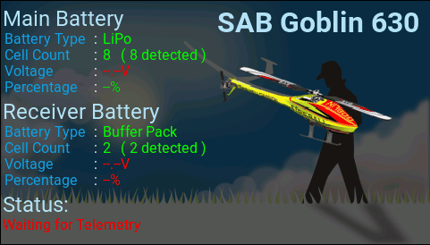

# TxBatTele :battery:

EdgeTX/OpenTX **Battery** and **Telemetry** Monitoring LUA Widget which tries to **rely as less as possible on radio settings** (Everything is defined in the Script). So no need for "manual" Logical Switches or Custom Functions.

It's supposed to be **"A jack of all trades"** kind of thing (at least for most "standard" needs) but with a main focus on Battery Monitoring.

You can also reach out to me on the EdgeTX LUA Discord Channel (see above)

## Key Features of TxBatTele ⭐
- **Receiver** and/or **Main Battery** Monitoring: Monitor your Main **and/or** Receiver Battery. Support for different Battery Types (lipo and buffer currently, can be extended for additional battery types easily)
- **Current Sensor**: Monitor Current Consumption if a Sensor is available
- **Other Sensors**: Monitor and show other Sensors and change their color based on >, < and = condition
- **Switch State Announcements**: Voice Announcements for any Switch Position (like Armed, Disarmed, Flightmode, and so on)
- **Status Pages**: Show pre, post and in flight Statuspage (widget)
- **Pre-Flight Checks**: Check for missing/inconsistent Cells, Battery not full conditions before flight
- **Voice Announcements**: Get periodic or on changes Voice Announcements for any Condition including haptic Feedback if needed (highly customizable)
- **Logging**: Take Screenshot of the Statuspage after flight or turn on logging if/as needed based on Conditions (like Battery at 30%) ( not yet possible ... but maybe >= EdgeTX 2.11 ... see pending Feature Request: https://github.com/EdgeTX/edgetx/issues/5191 and pending pull request: https://github.com/EdgeTX/edgetx/pull/5181 )

## Video :tv:

## Note
- **This is currently in alpha/"works for me" state ... use/try at your own Risk**
- Based on [mahRe2](https://github.com/fdm225/mahRe2). So full Credits to them!
- This is my first attempt in LUA Scripting. So please be gentle ;-)
- If you need/want custom voice announcements (for instance modelname) submit a feature request or patch the CSV .. i will try to generate new voices as soon as i have time to. Same applies for new Languages and/or voices (although that would require more work on my side and may take a little longer to implement ;-) )
- **Important:** We are dealing (actually relying on) with **Voltages** and "real" discharge Curves. So make sure your **Sensors are reporting the correct Values** (Check with a **Voltagemeter**) and adjust the Sensor **Offset** accordingly until it reports the real measured Value !

## How to contribute
- **Design the LCD Widget for various sizes** ( i'm not very good at designing / see Screenshots ;-) )

## How To's
### NO MAH Sensor
If you don't have a native **mah** Sensor but you do have a **Current** Sensor, you can add a **custom Sensor** like so:

and use it here:

### How to make automatic logging working
There is a pending Feature request open, to directly implement this in LUA. But for the time being you'll have to make some small Radio Settings in order to use this Feature:

Create a **Logical Switch** like so:

and then a **Special Function** for the actual logging:

Make sure to reference the correct **logical switch**. Then in the LUA Model Definition:

and again ... make sure to reference the correct **logical switch** by its index number. 0=L01, 1=L02 and so on.

### How to make automatic screenshots working
There is a pending Pull request open, to directly implement this in LUA. But for the time being you'll have to make some small Radio Settings in order to use this Feature:

Create a **Logical Switch** like so:

and then a **Special Function** for the actual screenshot taking:

Make sure to reference the correct **logical switch**. Then in the LUA Model Definition:

and again ... make sure to reference the correct **logical switch** by its index number. 0=L01, 1=L02 and so on.

